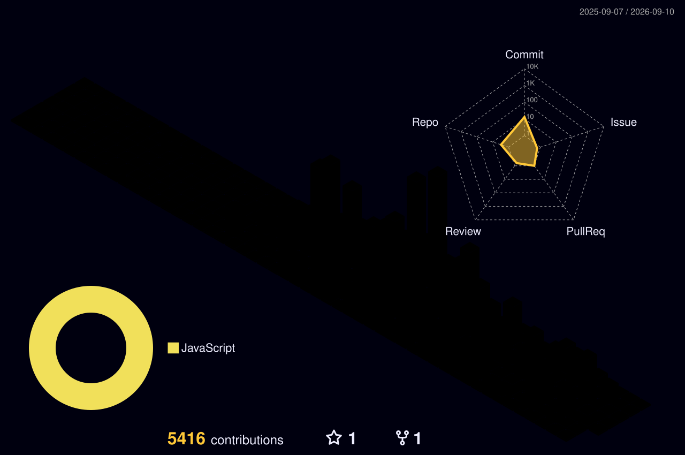

## Olá, me chamo Igor Sena, desenvolvedor web!

  
  

  
 |     |    |  
 | ----------- | ----------- |

 
  

   

  

 
##

<picture align="center">
  <source media="(prefers-color-scheme: dark)" srcset="https://raw.githubusercontent.com/IgorSSSena/IgorSSSena/output/github-contribution-grid-snake-dark.svg">
  <source media="(prefers-color-scheme: light)" srcset="https://raw.githubusercontent.com/IgorSSSena/IgorSSSena/output/github-contribution-grid-snake-dark.svg">
  
</picture>
 
  
  

  

